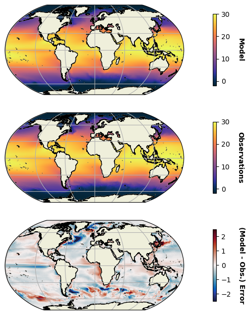

# **Welcome to the ValidOcean Documentation**

**ValidOcean is a python library dedicated to leveraging the cloud to accelerate ocean model validation :cloud:**

The library aims to facilitate the reproducible validation of ocean general circulation models using observations and ocean (re)analyses stored in Analysis-Ready & Cloud Optimised (ARCO) datasets.

ValidOcean utilises [xarray](https://xarray.dev) to handle N-D labeled arrays, [zarr](https://zarr.dev) for the reading & writing of ARCO datasets and [xesmf](https://xesmf.readthedocs.io/en/stable/) to perform regridding.

---

<div class="grid cards" markdown>

-   :timer:{ .lg .middle } __Get Started in Minutes__

    ---

    Install `ValidOcean` with `pip` and get up
    and running in minutes

    [:octicons-arrow-right-24: [Quick Start]](#)

-   :book:{ .lg .middle } __Tutorial__

    ---

    Learn by doing with the `ValidOcean` tutorial

    [:octicons-arrow-right-24: [Tutorials]](#)

-   :earth_africa:{ .lg .middle } __Observations__

    ---

    Explore the available ocean observations

    [:octicons-arrow-right-24: [Observations]](#)

-   :hammer:{ .lg .middle } __Customisation__

    ---

    Learn how to add new `DataLoaders` & custom `Aggregators`

    [:octicons-arrow-right-24: [Customisation]](#)

</div>

[Quick Start]: #quick-start
[Tutorials]: ex1_getting_started.ipynb
[Customisation]: customisation.md

---

## **Quick Start :rocket:**

### Installation

ValidOcean is currently in the pre-alpha development phase, so it is recommended to install the library in editable mode as shown below.

To get started, clone and install ValidOcean from [GitHub](https://github.com/NOC-MSM/ValidOcean):

```sh
git clone git@github.com:NOC-MSM/ValidOcean.git
```

Next, pip install the ValidOcean library in editable mode:

```sh
cd ValidOcean
pip install -e .
```

??? tip "Helpful Tip..."

    * **We strongly recommend installing the ValidOcean library and its dependencies in a new virtual environment.**

    The simplest way to create a new virtual environment is to use venv:

    ```sh
    python3.13 -m venv "env_validocean"
    ```

    Alternatively, using an existing miniconda or miniforge installation:

    ```sh
    conda create -n env_validocean python=3.13
    ```


## **An Example Validation Workflow :map:**

Let's consider a typical validation task for an ocean scientist; evaluating the average sea surface temperature field simulated in an ocean model against available observations.

To do this, we would likely start by downloading and pre-processing a satellite-derived sea surface temperature product (here, we'll use NOAA OISSTv2). Next, we would calculate equivalent sea surface temperature climatologies using your ocean model data and ocean observations, before regridding them onto a common grid (either the native grid used by the model or the observations). Finally, we would calculate the difference (or error) between the ocean model and observational climatologies and visualise this with a geographical plot.

With ValidOcean, each of the pre-processing & regridding stages above are performed for us and we can visualise the model - observations sea surface temperature error in two simple stages...

**Stage 1:**

To perform a validation workflow using ValidOcean, we must first prepare our ocean model data & create a ``ModelValidator`` object:

```python
    import xarray as xr
    from ValidOcean import ModelValidator


    ds = xr.open_dataset("/path/to/ocean/model/sst/data.nc")

    mv = ModelValidator(mdl_data=ds)
```

**Stage 2:**

Let's use the ``.plot_sst_error()`` method to visualise the ocean model & OISSTv2 sea surface temperature climatologies and their difference. Below we plot the (model - observation) error using 1991-2020 climatologies of sea surface temperature, where the observations are regridded to the native model grid using bilinear interpolation.

```python
    mv.plot_sst_error(sst_name='tos_con',
                      obs_name='OISSTv2',
                      time_bounds='1991-2020',
                      freq='total',
                      regrid_to='model',
                      method='bilinear',
                      source_plots=True,
                      stats=True,
                      )
```
{ align=center }

We've just performed our first validation workflow using **ValidOcean**. Subplots (1) & (2) show the climatological (1991-2020) average sea surface temperature for our ocean model and OISSTv2 observations (regridded onto the model grid). Subplot (2) shows the difference / bias between the ocean model and OISSTv2 observations, where positive (negative) values indicate warmer (colder) sea surface temperatues in the ocean model.

To learn more about the validation workflows available in **ValidOcean** and currently available ocean observations, explore our [Tutorial] and [Observations] pages.

[Tutorial]: ex1_getting_started.ipynb

[Observations]: observations.md
